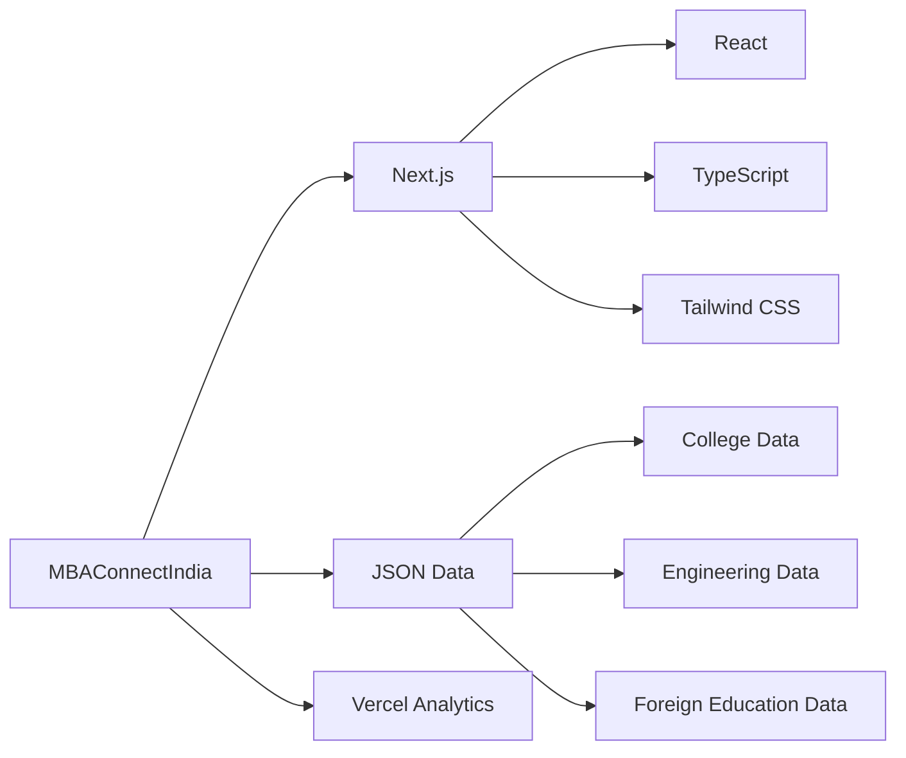
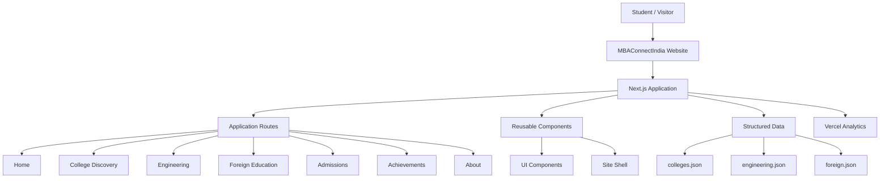
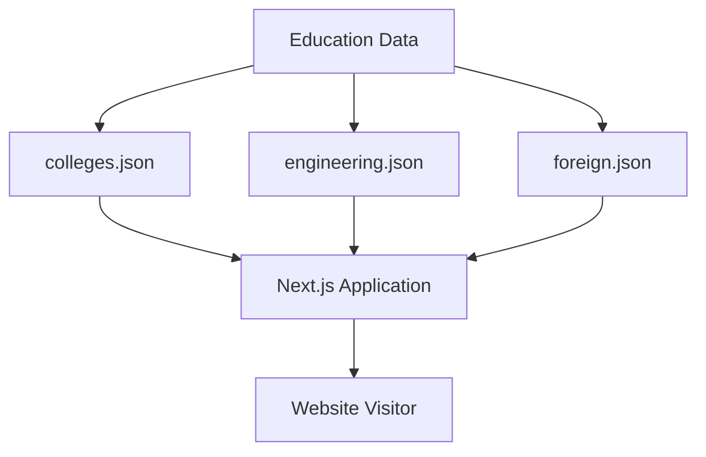
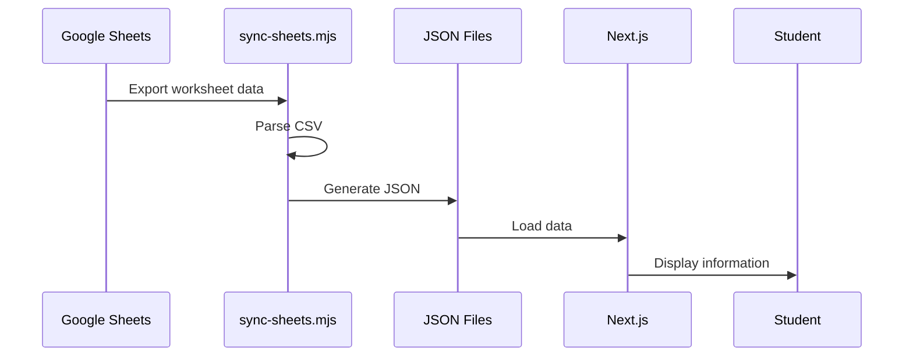
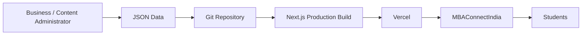
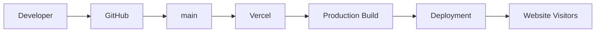

# MBAConnectIndia

> **MBAConnectIndia** is an academic counseling and education guidance platform designed to help students explore colleges, engineering programs, admissions opportunities, and international education pathways.

[](https://nextjs.org/)
[](https://react.dev/)
[](https://www.typescriptlang.org/)
[](https://tailwindcss.com/)
[](https://vercel.com/)

---

## About MBAConnectIndia

**MBAConnectIndia** is an education and academic counseling platform focused on helping students make informed decisions about their higher-education journey.

The platform brings together educational information and guidance across multiple categories, including:

- 🎓 College discovery
- ⚙️ Engineering education
- 📚 Admissions guidance
- 🌎 International education
- 🏆 Academic achievements
- 👨‍🏫 Academic counseling
- 📊 Structured college and course information

The website is designed to provide students with an accessible, responsive, and easy-to-navigate platform for exploring educational opportunities.

---

## Project Information

| Property         | Details                         |
| ---------------- | ------------------------------- |
| **Company**      | MBAConnectIndia                 |
| **Project**      | MBAConnectIndia Website         |
| **Repository**   | `gradselected`                  |
| **Framework**    | Next.js                         |
| **Language**     | TypeScript                      |
| **UI**           | React + Tailwind CSS            |
| **Deployment**   | Vercel                          |
| **Project Type** | Education / Academic Counseling |
| **Status**       | Production Website              |

### Repository

https://github.com/conenctindiamba-ui/gradselected

### Production Website

mbaconnectindia.com

---

# Features

## 🎓 College Discovery

Students can explore structured information about colleges and educational opportunities.

## ⚙️ Engineering Education

A dedicated section for engineering-related educational information and opportunities.

## 🌎 International Education

The platform provides a dedicated experience for students interested in studying abroad and exploring international education opportunities.

## 📚 Admissions

Admissions-related information is organized into dedicated sections to help students understand available opportunities.

## 🏆 Achievements

The website includes an achievements section for showcasing relevant academic accomplishments and information.

## 👨‍🏫 Academic Counseling

MBAConnectIndia is designed around the broader goal of helping students make better academic and career decisions through guidance and counseling.

## 📱 Responsive Design

The website is designed for:

- Desktop
- Laptop
- Tablet
- Mobile

---

# Technology Stack



### Core Technologies

| Technology       | Purpose                   |
| ---------------- | ------------------------- |
| Next.js          | Web application framework |
| React            | User interface            |
| TypeScript       | Type-safe development     |
| Tailwind CSS     | Styling                   |
| Lucide React     | Icons                     |
| Vercel Analytics | Analytics                 |
| Node.js          | Development environment   |

---

# Application Architecture



---

# Project Structure

```text
gradselected/
│
├── app/
│   ├── about/
│   ├── achievements/
│   ├── admissions/
│   ├── engineering/
│   ├── foreign/
│   │
│   ├── globals.css
│   ├── icon.png
│   ├── layout.tsx
│   └── page.tsx
│
├── components/
│   ├── ui/
│   └── site-shell.tsx
│
├── data/
│   ├── colleges.json
│   ├── engineering.json
│   └── foreign.json
│
├── lib/
│   └── utils.ts
│
├── public/
│   └── static assets
│
├── scripts/
│   └── sync-sheets.mjs
│
├── .gitignore
├── components.json
├── next.config.mjs
├── next-env.d.ts
├── package.json
├── package-lock.json
├── pnpm-lock.yaml
├── pnpm-workspace.yaml
├── postcss.config.mjs
├── tsconfig.json
└── README.md
```

This structure reflects the current repository, which contains the `app`, `components`, `data`, `lib`, `public`, and `scripts` directories.

---

# Data Architecture

MBAConnectIndia currently uses structured JSON datasets for education-related information.



The data layer is intentionally separated from the UI so that educational information can be updated without redesigning the application.

---

# Data Synchronization

The repository also contains:

```text
scripts/sync-sheets.mjs
```

This script is responsible for synchronizing configured Google Sheets data into local JSON datasets.



> **Production recommendation:** If MBAConnectIndia is intended to operate as a fully static website, the JSON files can become the primary source of truth and the Google Sheets synchronization dependency can be removed.

---

# Recommended Static Architecture

For a production-oriented deployment, the preferred architecture is:



### Benefits

- No runtime dependency on Google Sheets
- Faster page delivery
- Predictable builds
- Easier backups
- Version-controlled data
- Easier migration between hosting providers
- Suitable for a primarily static website

---

# Getting Started

## Requirements

Install:

- Node.js 20+
- npm / pnpm / Yarn
- Git

---

## Clone Repository

```bash
git clone https://github.com/Aman35256/gradselected.git
cd gradselected
```

---

## Install Dependencies

Using npm:

```bash
npm install
```

Or pnpm:

```bash
pnpm install
```

---

## Run Development Server

```bash
npm run dev
```

Open:

```text
http://localhost:3000
```

---

# Available Commands

| Command         | Purpose                   |
| --------------- | ------------------------- |
| `npm run dev`   | Start development server  |
| `npm run build` | Create production build   |
| `npm run start` | Start production server   |
| `npm run sync`  | Synchronize external data |

### Development

```bash
npm run dev
```

### Production Build

```bash
npm run build
```

### Production Server

```bash
npm run start
```

### Data Synchronization

```bash
npm run sync
```

---

# Production Deployment

MBAConnectIndia can be deployed using Vercel or another Next.js-compatible hosting provider.



### Recommended deployment flow

1. Push the latest code to GitHub.
2. Connect the repository to Vercel.
3. Configure the production domain.
4. Configure required environment variables, if any.
5. Run the production build.
6. Verify all pages.
7. Connect the final business domain.

---

# Production Checklist

Before handing over the website to MBAConnectIndia:

- [ ] Production domain connected
- [ ] HTTPS enabled
- [ ] Mobile responsiveness verified
- [ ] Desktop responsiveness verified
- [ ] Navigation tested
- [ ] All forms tested
- [ ] Advisor/contact buttons tested
- [ ] JSON data verified
- [ ] Images optimized
- [ ] SEO metadata configured
- [ ] Favicon configured
- [ ] Analytics verified
- [ ] 404 handling tested
- [ ] Production build successful
- [ ] No secrets committed
- [ ] Data backup created
- [ ] Google Sheets dependency reviewed
- [ ] GitHub ownership/access configured

---

# Security

Never commit sensitive information to the repository.

Do not store:

```text
API keys
Passwords
Authentication tokens
Private credentials
Private student information
Confidential business information
```

inside:

```text
data/
public/
app/
```

or any other client-accessible location.

Anything shipped to the browser should be considered publicly accessible.

---

# Data Ownership

The education data displayed by the website should be maintained and verified by the business/client before publication.

MBAConnectIndia should ensure that:

- College information is accurate.
- Admission information is current.
- External links are valid.
- Published contact information is authorized.
- Student-facing information is reviewed periodically.

---

# Development Guidelines

## Components

Use reusable components wherever possible.

```text
components/
├── ui/
└── site-shell.tsx
```

Avoid unnecessarily duplicating UI code across pages.

---

## Data

Maintain consistent JSON structures.

Example:

```json
[
  {
    "name": "Example College",
    "location": "India",
    "category": "Engineering"
  }
]
```

When updating data:

1. Preserve existing fields.
2. Preserve data types.
3. Avoid accidental field renaming.
4. Validate JSON.
5. Test affected pages.
6. Verify production build.

---

# Git Workflow

Create a feature branch:

```bash
git checkout -b feature/your-feature
```

Test locally:

```bash
npm run dev
```

Verify production build:

```bash
npm run build
```

Commit:

```bash
git add .
git commit -m "feat: describe your change"
```

Push:

```bash
git push origin feature/your-feature
```

Then create a Pull Request.

---

# Commit Convention

Recommended prefixes:

| Prefix      | Purpose            |
| ----------- | ------------------ |
| `feat:`     | New feature        |
| `fix:`      | Bug fix            |
| `docs:`     | Documentation      |
| `style:`    | Styling            |
| `refactor:` | Code restructuring |
| `perf:`     | Performance        |
| `chore:`    | Maintenance        |
| `data:`     | Data update        |

Examples:

```text
feat: add college search
fix: correct admission information
data: update college dataset
docs: update deployment guide
style: improve mobile navigation
```

---

# Future Improvements

Potential future improvements include:

- [ ] Replace Google Sheets dependency with JSON-only data management
- [ ] Add automated JSON validation
- [ ] Add advanced college filtering
- [ ] Add college comparison
- [ ] Add search functionality
- [ ] Add sitemap generation
- [ ] Add structured SEO metadata
- [ ] Add automated testing
- [ ] Add CI/CD checks
- [ ] Add accessibility testing
- [ ] Add automated broken-link checking
- [ ] Add dedicated content management workflow
- [ ] Add admin/content dashboard

---

# Project Status

**MBAConnectIndia website is a production-oriented academic counseling platform.**

The current GitHub repository is named `gradselected`, while the customer-facing/business name of the project is **MBAConnectIndia**.

---

# License & Ownership

This repository should not be treated as an open-source project unless a specific open-source license is intentionally added.

For a business/client project, ownership, usage rights, source-code transfer, maintenance responsibilities, and liability should be governed by the separate written agreement between the developer and **MBAConnectIndia**.

---

<p align="center">
  <strong>MBAConnectIndia</strong><br>
  Academic Counseling & Education Guidance
</p>
